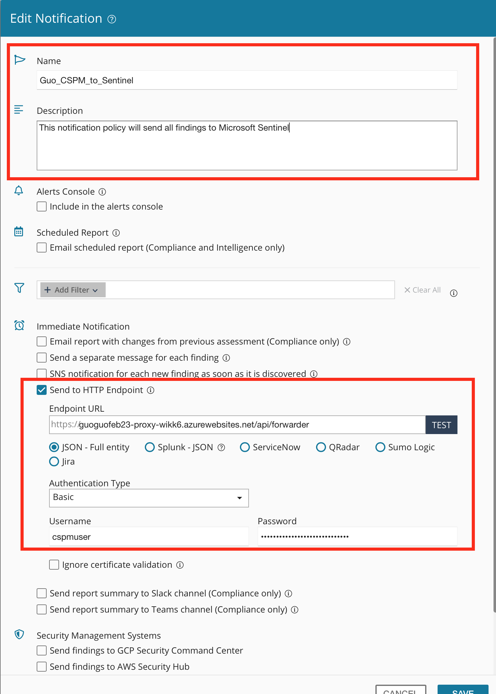

# Cloudguard CSPM webhook forwarder for Microsoft Sentinel
 
 

  
 </a>

 

# Table of Contents

1. [Overview](#overview)
2. [Prerequisites](#prereq)
2. [Deploy](#deploy)
3. [Test notifications from CSPM to Sentinel](#testnotifications)

 

<a name="overview">

# Overview

This is an Azure function app that serves as a webhook forwarder. It will allow users to send notifications from Check Point CloudGuard CSPM to Microsoft Sentinel. This repo will deploy the webhook forwarder as an Azure function app. 

  
 </a>

For more information see:

[CloudGuard CSPM Notification](https://sc1.checkpoint.com/documents/CloudGuard_Dome9/Documentation/Settings/Notifications.htm?tocpath=Settings%20%7C_____4)

[Microsoft Sentinel Data Collector API](https://docs.microsoft.com/azure/sentinel/connect-rest-api-template)  

[Logic App Overview](https://azure.microsoft.com/services/logic-apps/)

 
 

<a name="prereq">

# Prerequisites

1. You must have read and write permissions on the Microsoft Sentinel workspace.

2. You must have read permissions to shared keys for the workspace.

    [Learn more about workspace keys.](https://docs.microsoft.com/en-us/azure/azure-monitor/agents/agent-windows)

 
 

<a name="Deploy">

# Deploy

1. Get Microsoft Sentinel Workspace ID and Primary Key 

    a. From Azure Portal -> Microsoft Sentinel Workspace -> Settings -> Workspace settings -> Agents management

    b. Copy Workspace ID and the Primary Key

    
  
     </a>
    

2. Launch Template

    

3. Fill template details

    
  
     </a>
    

4. Obtain function app endpoint URL

    
  
     </a>
    

5. Configure Cloudguard CSPM notification 

    a. Login to Check Point CloudGuard CSPM portal

    b. Settings -> Notifications -> Add Notification 
    
    c. Fill in the details
    
    d. Endpoint url - make sure to include the following at end of function URL "/api/forwarder/"
    
    e. Test endpoint
    
    f. Save notification policy

    Example: 

    
  
     </a>
    

6. Assign notification policy to a security bundle

    a. From CloudGuard CSPM portal

    b. Posture Management -> Continous Posture -> Select bundle
    
    c. Edit bundle notiifcation policy 

    
  
     </a>
    

    d. Select notification policy and Save settings

    
  
     </a>
    

# Test notifications

1. From CloudGuard CSPM portal

2. Posture Management -> Continous Posture -> Select bundle   

3. Select "Send all alerts"
    
  
     </a>
    

4. Select notification policy and Send
    
  
     </a>
    

5. From Microsoft Sentinel Workspace -> Select CloudguardCSPM_CL or user specified log_type name for CloudGuard CSPM. 

    
  
     </a>
    

    Note: Microsoft Sentinel Data Collector API appends "_CL" to all ingested data fields. 

6. Filter events

    a. Filter by: 

        - rule_severity_s
        - rule_ruleId_s
        - rule_name_s
        - entity_region_s
        - entity_name_s
        - rule_description_s
        - rule_remediation_s
        - entity_id_s

    example: 

    
  
     </a>
    
